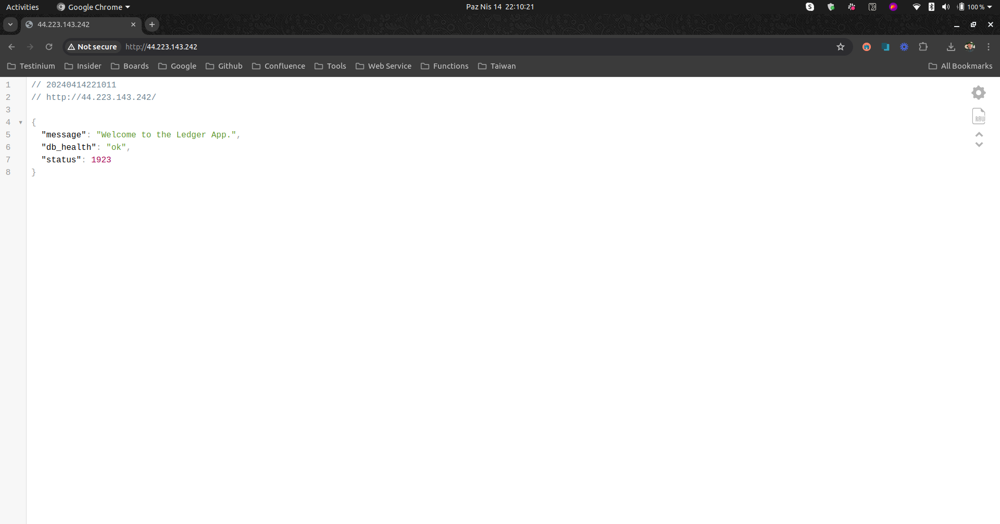
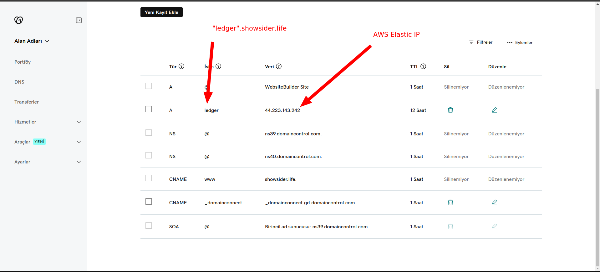
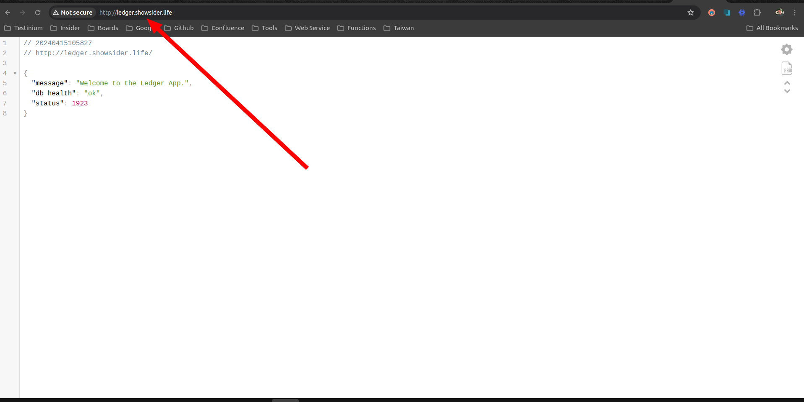
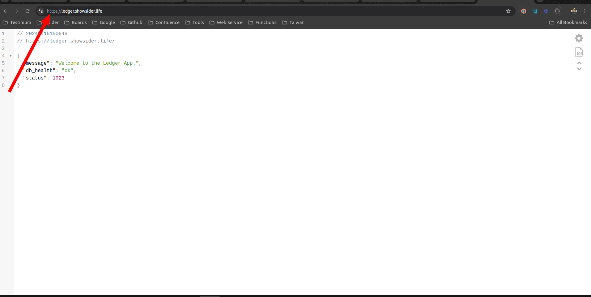

# How to deploy this api on AWS EC2?

## Step 1: Create an EC2 instance
Just visit the AWS Console site and launch a new instance with default configurations. [Ubuntu Server]
While you are launching the instance you need the create a new Key Pair for ssh login. 

Then you need the create an Elastic Ip and associate it with the instance. This will give you a static IP address for the instance.
## Step 2: Connect to the instance
After launching the instance you will get a public IP address. Use this IP address to connect to the instance using SSH.
```bash
ssh -i "your-key.pem" ubuntu@your-public-ip
```

## Step 3: Configuration the instance
Update the package list and install the required packages.

Switch the sudo mode.
```bash
sudo su
```

```bash
apt update -y
apt install docker -y
apt install docker.io -y
usermod -aG docker ubuntu
curl -L "https://github.com/docker/compose/releases/download/v2.24.6/docker-compose-Linux-x86_64" -o /usr/local/bin/docker-compose
chmod +x /usr/local/bin/docker-compose
service docker start
apt install git -y
apt install gh -y
apt install python3 -y
apt install python3-pip -y
```

### Step 4: Build the project
```bash
git clone https://github.com/anilonayy/ledger-app.git
cd ./ledger-app/deployer
chmod +x ./deployer.sh
./deployer.sh magic --prod
```
### Hmmm but i still can't see my project in the browser 🥺

And after these steps you still may need to configure the security group of the instance to allow the incoming traffic on the port 80 and 443.

And ta daaaa! You have deployed the project on AWS EC2.



## Don't exicted yet! We still have not SSL Certificate...


We should configure our domain to point to our elastic ip address with A Name record.





I'm took reference from [this](https://www.youtube.com/watch?v=yhiuV6cqkNs&ab_channel=Scale-UpSaaS) video while preparing this file.

After these steps, if we want to open with SSL, we first need an Elatic Load Balancer. When installing Elastic Load Balancer, we need to create Target Groups and when creating a group, if we are using the EC2 service (we are using this one), we should select the Instance option and proceed. Then we need to edit Listener for ELB, we need to edit these listener as HTTPS 443, HTTP Redirecting To HTTPS.

Afterwards, when we enter the ELB detail, we see a DNS name. We enter this DNS as a CNAME record in our related Domain provider.


# Anddd done! We have SSL Certificate now! 🎉🎉🎉



https://github.com/saasscaleup/nodejs-ssl-server
